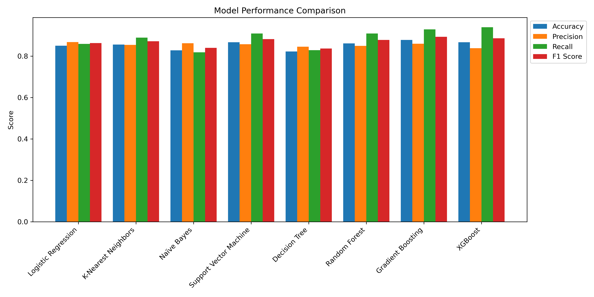
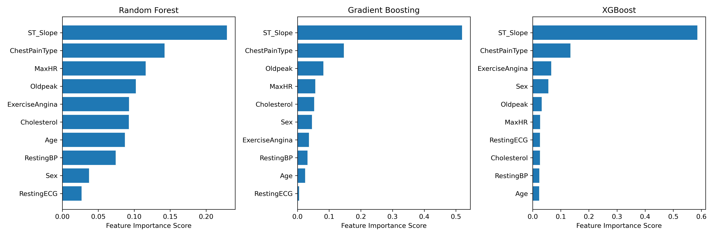

# Predicting Heart Disease Risk Using Machine Learning

## Isaac Escobar

### Executive Summary

#### Overview and Goals
This project focuses on using machine learning to predict heart disease based on medical data. By training and evaluating eight models (Logistic Regression, Support Vector Machine, Random Forest,Gradient Boosting, Naives Bayes, Decision Trees, KNN and XGboost), the goal is to identify which model performs the best in classifying individuals as having heart disease or not. Additionally, the project analyzes feature importance to determine the factors that contribute most to accurate predictions.

#### Why It Matters (Rationale)
Heart disease is a leading cause of illness and death worldwide. Early detection can save lives by enabling timely treatment and lifestyle changes. This project demonstrates how machine learning can assist in identifying individuals at risk, offering a tool that complements traditional diagnostic methods.

#### Research Questions
Which machine learning model is most effective at predicting heart disease?
What are the most important features (e.g., age, blood pressure) in making accurate predictions?

#### Data 
Dataset:
The data was sourced from a publicly available medical dataset containing patient information such as age, blood pressure, cholesterol levels, and exercise-related heart metrics. The link is below and the data will be in this repository.

https://www.kaggle.com/datasets/fedesoriano/heart-failure-prediction/data

Contains information on Age, Gender, Resting Blood Pressure (RestingBP)
Cholesterol, Maximum Heart Rate (MaxHR)
Exercise Angina, Oldpeak (ST depression), and ST Slope

The target variable, HeartDisease, indicates the presence (1) or absence (0) of heart disease.

#### Methodology
1. Data Cleaning and Preprocessing:

-Handle missing or redundant columns (if necessary).
-Encode categorical variables such as Chest Pain Type and ST Slope using techniques like one-hot encoding or label encoding.
-Normalize numerical features such as RestingBP, Cholesterol, and MaxHR for better model performance.

2. Exploratory Data Analysis (EDA):

-Generate summary statistics to understand feature distributions.
-Create visualizations (e.g., histograms, boxplots, and correlation heatmaps) to explore relationships between features and the target variable.
-Identify key trends and patterns in the dataset.

3. Feature Engineering:

-Investigate and retain the most relevant features for predicting heart disease.


4. Model Development:

-Train multiple machine learning models, including Logistic Regression, Support Vector Machines, Random Forest, and Gradient Boosting.
-Use GridSearchCV for hyperparameter tuning to optimize each model.

5. Evaluation Metrics:

-Evaluate models using metrics such as accuracy, precision, recall, F1-score, and ROC-AUC.

-Use confusion matrices to analyze false positive and false negative rates.


#### Data and Cleaning Results

No missing values were found initially which was amazing. However, further analysis showed that restingBP, cholesterol, and oldpeak had unrealistic values. 
Zero values in RestingBP and Cholesterol were replaced with NaN since they were deemed invalid.
Missing values in numerical columns (RestingBP, Cholesterol, Oldpeak) were imputed using the mean of each column.
Outliers were removed based on domain-specific thresholds:
RestingBP: Valid range set between 50 and 200 mmHg.
Cholesterol: Retained values between 100 and 500 mg/dL.
Oldpeak: Negative values were removed, as they are invalid for this feature.
The categorical columns had no missing values and one was one- hot encoded to convert them into numeric machine learning format

FastingBS was dropped due to lack of variance. Every entry contained the value 1. ST_Slope_str and ChestPainType_str were dropped because they ended up being redudant on graphs after these features were one- hot encoded.

#### Exploratory Data Analysis Results


```python
from IPython.display import Image, display

# Display the saved correlation heatmap
display(Image(filename='correlation_heatmapHeartDisease.png'))
```


    

    


1. Correlation Analysis
Key predictors of heart disease include ST_Slope (-0.56), ExerciseAngina (0.50), and MaxHR (-0.39). Age (0.29) and Oldpeak (0.27) show weaker but notable relationships. Cholesterol and RestingBP display minimal correlation, making them less important for prediction.

2. Numerical Feature Distributions
Most individuals in the dataset are aged 50-60, aligning with the higher risk of heart disease in older populations. Resting blood pressure is typically within 120-140 mm Hg, and cholesterol peaks around 250 mg/dL but shows little connection to heart disease. Maximum heart rates are generally 130-160 bpm, with lower rates linked to higher risk. Oldpeak values, representing ST depression during exercise, cluster around 0-2, with higher values associated with heart problems.

3. Boxplots for Numerical Features
Boxplots confirm that people with heart disease tend to be older, while cholesterol and resting blood pressure have similar distributions across both groups, suggesting they are weaker predictors.

4. Proportions and Bar Plots for Categorical Variables
Asymptomatic chest pain (Type 0) and flat ST slopes are associated with the highest proportion and count of heart disease cases. Proportion plots highlight relative risks, while bar plots show total cases, together providing a complete understanding of categorical features.

### Model Developement


In this phase, I focused on building and optimizing machine learning models to predict heart disease. The process included data preprocessing, selecting models, training, and hyperparameter tuning.

####  Data Preparation
I loaded the cleaned dataset (cleaned_heart_disease_dataset.csv) and split it into features (X) and target (y). I used stratified train-test splitting to ensure balanced class distribution, with 80% for training and 20% for testing. To enhance model performance, I standardized the features using StandardScaler. The processed datasets (X_train_scaled, X_test_scaled, y_train, y_test) were saved for consistent use in model training.

####  Model Selection & Training
I implemented and trained eight different models to compare their performance:

- Logistic Regression
- K-Nearest Neighbors (KNN)
- Naïve Bayes
- Support Vector Machine (SVM)
- Decision Tree
- Random Forest
- Gradient Boosting
- XGBoost

Each model was initially trained on X_train_scaled and y_train with default settings before moving on to tuning.

####  Hyperparameter Tuning
I used GridSearchCV with 5-fold cross-validation to find the best hyperparameters for each model. The optimal parameters were:

| Model                 | Best Parameters                             |
|-----------------------|--------------------------------------------|
| Logistic Regression   | C = 0.1                                    |
| K-Nearest Neighbors   | n_neighbors = 7                            |
| Naïve Bayes          | No tuning needed                           |
| SVM                  | C = 1, Kernel = RBF                        |
| Decision Tree        | max_depth = 5                              |
| Random Forest        | n_estimators = 200, max_depth = 10         |
| Gradient Boosting    | n_estimators = 50, learning_rate = 0.1     |
| XGBoost              | n_estimators = 50, learning_rate = 0.1     |

#### Key Takeaways from Model Development
- Regularization (C=0.1) improved Logistic Regression, helping to prevent overfitting.
- KNN performed best with k=7, striking a balance between bias and variance.
- Depth constraints were essential for tree-based models—Decision Tree (max_depth=5) and Random Forest (max_depth=10).
- Boosting models (Gradient Boosting & XGBoost) excelled with fewer trees (50) and a moderate learning rate (0.1), optimizing performance without overfitting.

This structured approach to model development provided a solid foundation for creating a reliable heart disease prediction model.

### Evaluation Metrics


To measure how well each model performed, I used five key classification metrics:

- Accuracy: The percentage of correctly classified cases out of all cases.
- Precision: The percentage of positive predictions that were actually correct.
- Recall: How well the model identifies actual positive cases.
- F1 Score: A balance between precision and recall.
- ROC-AUC Score: Measures how well the model distinguishes between positive and negative cases.

### Model Finding and Results
Each model was tested on unseen data (X_test_scaled, y_test), and the results were recorded:

| Model                 | Accuracy | Precision | Recall | F1 Score | ROC-AUC |
|-----------------------|----------|-----------|--------|----------|---------|
| Logistic Regression   | 85.00%   | 86.73%    | 85.86% | 86.29%   | 91.07%  |
| K-Nearest Neighbors   | 85.56%   | 85.44%    | 88.89% | 87.13%   | 92.57%  |
| Naïve Bayes          | 82.78%   | 86.17%    | 81.82% | 83.94%   | 90.39%  |
| Support Vector Machine | 86.67%  | 85.71%    | 90.91% | 88.24%   | 92.68%  |
| Decision Tree        | 82.22%   | 84.54%    | 82.83% | 83.67%   | 87.53%  |
| Random Forest        | 86.11%   | 84.91%    | 90.91% | 87.80%   | 93.04%  |
| Gradient Boosting    | 87.78%   | 85.98%    | 92.93% | 89.32%   | 92.13%  |
| XGBoost             | 86.67%   | 83.78%    | 93.94% | 88.57%   | 91.86%  |

#### Model Comparison
A bar chart was created to compare how each model performed across accuracy, precision, recall, and F1 score. I also plotted ROC curves to examine how well the models balance true and false positive rates which can be found in the model_development file.

with open("README.md", "a") as f:
    f.write("\n\n### Model Performance Graph\n")
    f.write("Below is a visual comparison of the model performance across different metrics:\n\n")
    f.write("\n")


####  Key Observations
- **Gradient Boosting had the highest accuracy (87.78%)**, making it the strongest overall performer.
- **XGBoost had the highest recall (93.94%)**, meaning it was the best at detecting positive cases.
- **Logistic Regression had the best precision (86.73%)**, suggesting it made fewer false positive errors.
- **Random Forest had the highest ROC-AUC score (93.04%)**, meaning it was very effective at distinguishing between positive and negative cases.

#### Final Model Decision

After comparing all models, XGBoost was chosen as the best model for predicting heart disease. It had the highest recall (93.94%), meaning it was the best at identifying actual heart disease cases. In a medical setting, recall is more important than precision because missing a case of heart disease could have serious consequences.

While XGBoost’s precision (83.78%) was lower than Logistic Regression, it is a trade-off worth making since catching more positive cases is the priority. Gradient Boosting (Accuracy = 87.78%, F1 Score = 89.32%) was the next best option, offering strong accuracy and balanced performance. However, since recall is the main focus, XGBoost is the best choice.

By using XGBoost, we reduce the chances of missing heart disease cases while still maintaining solid overall performance.


### Feature Importance Analysis

Understanding which features contribute most to heart disease prediction helps improve model performance and interpretability. Feature importance scores were extracted from tree-based models, including Random Forest, Gradient Boosting, and XGBoost. The results are shown in the figure below.

### 1. Key Findings
- ST_Slope was the most important feature across all models, showing its strong influence on heart disease prediction. Changes in ST-segment slope during exercise appear to be a critical indicator of cardiac health.
- Chest Pain Type ranked second in importance, highlighting its role as a key diagnostic factor for heart disease.
- Exercise-induced Angina, Oldpeak, and Max Heart Rate (MaxHR) were also among the top predictive features, reinforcing their significance in assessing cardiovascular risk.
- Other clinical indicators like Cholesterol, Resting Blood Pressure, and Age contributed to model decisions, though their importance varied between models.

### 2. Model Comparisons
- Random Forest assigned high importance to ST_Slope and Chest Pain Type, with MaxHR and Cholesterol also contributing significantly.
- Gradient Boosting followed a similar pattern but gave slightly more weight to Oldpeak.
- XGBoost also highlighted ST_Slope as the most influential feature but ranked Exercise Angina and Sex higher than the other models, suggesting potential differences in how it interprets risk factors.

These results confirm that physiological stress indicators and patient symptoms play a major role in predicting heart disease. The insights from feature importance rankings can help guide further research into early detection and prevention.

### Feature Importance Visualization
The figure below shows the feature importance rankings for each model:


"""

# Append this section to README.md
with open("README.md", "a") as f:
    f.write(readme_text)

print("Feature Importance section added to README.md")


### Future Works and Reccomendations

### Final Summary

Per my learning facilitator Jessica Cervi, this initial research part of the capstone is only graded based on EDA and data cleaning. My model results will be in my final report.

# Heart Disease Project

You can download the following files related to this proct: 


[Download HeartDisease_datacleaning.ipynb](./HeartDisease_datacleaning.ipynb)
 pynb)
- [Download HeartDisease_EDA.ipynb](./HeartDisease_EDA.ipynb)


```python

```
